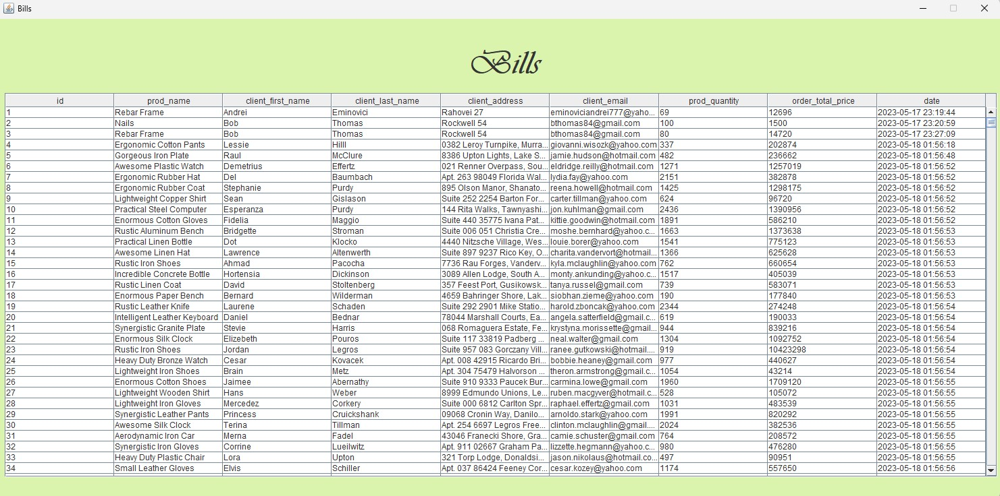
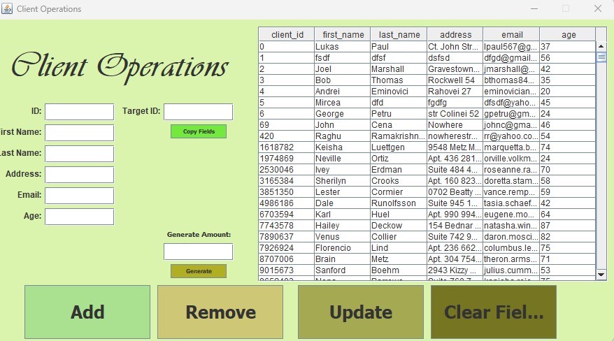
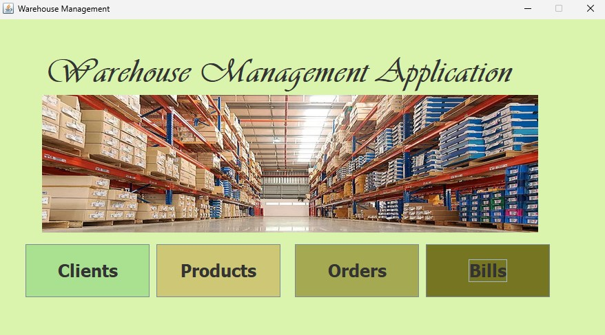
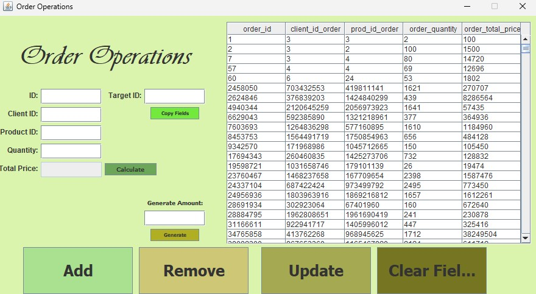
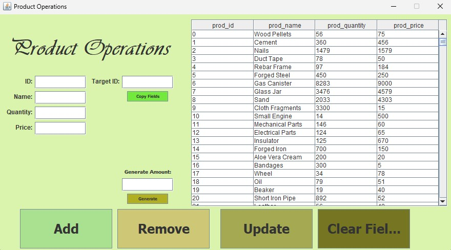

# Warehouse Management Application

## Objective

The main purpose of this project is to develop a warehouse management application. The application allows users to interact with a database via a graphical user interface for storing, updating, retrieving, and removing information. The secondary objectives include:

- Utilizing basic principles of Object-Oriented Programming (OOP) such as abstraction, encapsulation, inheritance, and polymorphism.
- Using the JDBC Java library for database interaction.
- Implementing the specified features.
- Creating a user interface using Java Swing.

## Problem Analysis, Modeling, Scenarios, Use Cases

### Database Structure

A database consists of tables, where each table comprises rows uniquely identified by a primary key (ID). In Java, the database tables are mirrored by identical Java classes, enabling reflection operations to work correctly. Each mirror class must have an empty constructor to facilitate reflection procedures.

### User Interaction

The application allows users to choose a database table for interaction and perform CRUD operations by inserting appropriate data into text fields. Additionally, users can copy fields from an existing database row to streamline the update operation.

### Testing

A "Generate Random" feature is implemented to quickly populate the database with random entries for testing purposes.

## Implementation

The implementation follows a design pattern where table names in the database match the names of mirror objects in Java. The application architecture includes:

- **AbstractDAO**: Abstract class containing methods for database interaction.
- **ConnectionFactory**: Facilitates communication with the database.
- **BusinessLogicLayer**: Acts as an intermediary between DAO and controllers, adding extra validations.
- **View**: JFrame instances creating the graphical interface.

The MainController orchestrates the logic behind the application along with functionality for each button, including the random entry generator.

## Conclusions

Through this project, I gained familiarity with reflection and its applications, as well as concepts like database backup and JavaDoc documentation. The application is considered complete and expandable for future developments.

## Screenshots


*Warehouse Bills*


*Warehouse Client*


*Warehouse Main*


*Warehouse Order*


*Warehouse Product*

## Usage

To run the application, simply execute the `App` class. Ensure you have Java installed on your system.

## Cloning Instructions

To clone this repository, run the following command in your terminal:

```bash
git clone https://github.com/AndreiE91/Warehouse-Management-App.git
```
